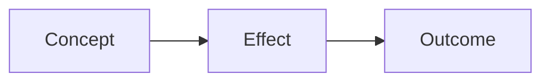

# Study Guide

Build a study guide from whatever course materials you point to. Reads files first — only searches the web if explicitly asked.

## Workflow

### 1. Gather materials
Read all files the user provides: lecture notes, PDFs, slides, textbook excerpts, past exams, problem sets. For PDFs, use `Read(pages: "N-M")` in chunks.

### 2. Clarify scope
If the user hasn't said what to cover, ask: which topics, units, or exam sections? What does the exam look like (multiple choice, short answer, essays, problems)?

### 3. Extract
Pull out: definitions, theorems, formulas, important examples, recurring themes, key dates/names (for humanities), and gotchas. Note which topics appear in assignments/past exams vs. just lecture.

### 4. Diagram what benefits from it
Use Mermaid for relationships, timelines, and processes that are hard to follow as prose:
- Causal chains (`graph LR`)
- Hierarchies (`graph TD`)
- Timelines (sequential events)
- Concept maps



Don't add diagrams for their own sake — only when a visual genuinely reduces cognitive load vs. a bullet list.

### 5. Write the guide

Output as a clean markdown file to `~/notes/courses/<course-name>/study-guide-<topic>.md`.

---

## Output Structure

```markdown
# Study Guide: [Course / Topic]

**Covers**: [Units/topics]
**Exam format**: [If known]
**Materials used**: [Files read]
**Date**: [Today]

---

## 1. [Topic]

### Key Concepts
- **[Term]**: precise definition
- **[Term]**: precise definition

### Core Ideas
- [Concept: what it is, why it matters, how it connects]

### Formulas / Theorems
- [Formula + when to use it]

### Examples
- [Concrete example from materials, with source]

### Common Mistakes
- [Pitfall students hit on this topic]

### Diagram (if useful)
[Mermaid or description]

### Practice Questions
1. [Question testing understanding, not recall]

---

## Gaps & Weak Coverage
- [Topics thin in the materials — flag, don't guess]
- [What to ask the professor or look up]
```

---

## Adapting to Exam Format

| Exam type | Emphasis |
|---|---|
| Multiple choice | Precise definitions, edge cases, distractors |
| Short answer | Concise explanations, formulas, worked examples |
| Essay | Themes, connections, argument structures |
| Problem solving | Step-by-step methods, common setups |
| Open book | Quick-reference format, formulas grouped by topic |

---

## Quality checks

Before finishing:
- [ ] Every definition is sourced from the materials — no guessing
- [ ] Topics ordered so prerequisites come first
- [ ] Mermaid diagrams only where they help (not decorative)
- [ ] Practice questions test understanding, not just recall
- [ ] Gaps explicitly flagged
- [ ] Format matches the exam type
- [ ] Saved to `~/notes/courses/<course>/`
